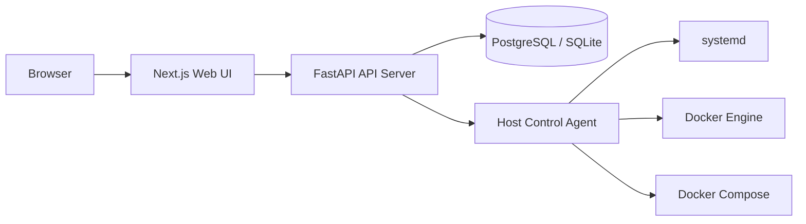
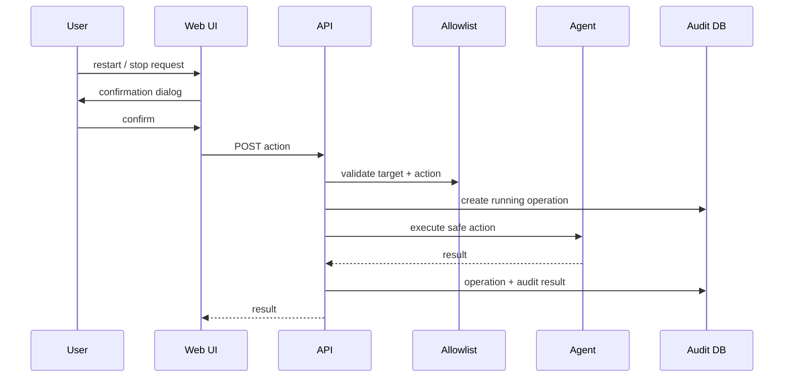

# Ubuntu Ops Control Console

個人用 Ubuntu サーバで稼働する systemd / Docker / Docker Compose を、Web UI から安全に監視・限定操作するための運用コンソールです。

## 🧭 Status

| 項目 | 状態 | メモ |
| --- | --- | --- |
| 🖥️ Web UI | ✅ MVP 実装済み | Dashboard / systemd / Docker / Compose / Logs / Operations / Audit Logs / Settings |
| 🔌 API | ✅ MVP 実装済み | FastAPI、allowlist、履歴、監査ログ |
| 🤖 Agent | ✅ Demo/Local 基盤実装済み | demo backend と限定 host operation backend |
| 🗄️ DB | ✅ 起動検証済み | PostgreSQL compose、ローカル SQLite fallback |
| 🛡️ Security | ✅ 強化済み | Webのみ公開、API/Agent内部化、operator token、Agent側allowlist、拒否操作監査 |
| 📚 Docs | ✅ 更新済み | `docs/` に仕様・運用・セキュリティ文書を配置 |
| 🔁 CI | ✅ 追加済み | GitHub Actions Release Gate: Python / Web / Compose |

## 📊 Project Board

| 管理対象 | Link |
| --- | --- |
| GitHub Repository | https://github.com/Kensan196948G/Ubuntu-Operations-Control-Console |
| GitHub Project | https://github.com/users/Kensan196948G/projects/35 |
| Open Issues | https://github.com/Kensan196948G/Ubuntu-Operations-Control-Console/issues |

## 🧩 Architecture



## ✅ MVP Scope

| 領域 | 実装すること | 実装しないこと |
| --- | --- | --- |
| systemd | 許可済み unit の status / logs / start / stop / restart | disable / mask / daemon-reload / 任意 unit 操作 |
| Docker | 許可済み container の status / logs / start / stop / restart | rm / rmi / volume rm / prune / exec |
| Compose | 許可済み project の ps / logs / restart | down / down -v / volume 削除 |
| 監査 | 操作履歴、IP、User-Agent、結果の記録 | 会社用途の権限管理 |
| 認証 | MVPでは未実装、localhost/LAN 前提 | インターネット直接公開 |

## 🚀 Quick Start

```bash
cp .env.example .env
docker compose up --build
```

| サービス | URL |
| --- | --- |
| Web UI | http://127.0.0.1:3000 |
| API Proxy | http://127.0.0.1:3000/ops-api |

`docker compose` では API と Agent は host に公開せず、Web から Docker 内部ネットワーク経由でアクセスします。

## ⚙️ Configuration

| ファイル | 用途 |
| --- | --- |
| `config/allowlist.example.yaml` | 操作を許可する systemd unit / container / compose project |
| `config/app.example.yaml` | API / Agent / ログ制限などのアプリ設定 |
| `.env.example` | Docker Compose とローカル起動用の環境変数 |

`UOCC_OPERATOR_TOKEN` は必ずランダムな長い値へ変更してください。Web proxy がこの token を API に内部注入し、mutating action を保護します。

## 🛡️ Security Model



安全境界:

| 制御 | 方針 |
| --- | --- |
| Allowlist | 登録済み対象・登録済み action のみ許可 |
| Agent allowlist | Agent も自身の allowlist から対象を復元し、API から渡された `name/path` を信用しない |
| Operator token | `POST /actions/*` は `X-UOCC-Operator-Token` 必須 |
| Origin check | mutating request は許可済み Origin のみ |
| 操作種別 | start / stop / restart / ps / logs に限定 |
| ログ行数 | 最大 1000 行 |
| ログ秘匿 | `password` / `token` / `secret` / `Authorization` / `Bearer` などを `[REDACTED]` に置換 |
| 公開範囲 | 初期設定は Web のみ `127.0.0.1` bind、API/Agent は internal expose |
| 復旧 | Web/API 停止時も SSH で復旧できる前提 |

## 🧪 Verification

```bash
# API
cd apps/api
python -m pytest

# Web
cd apps/web
npm run lint
npm run typecheck
npm audit --audit-level=high

# 全体
docker compose config
docker compose build
docker compose up
```

Note: この環境のホスト Node.js v25 では Next/SWC の Wasm メモリ確保で `npm run build` が失敗する場合があります。リリース検証は Dockerfile の Node 22 環境で `docker compose build` を正としています。

GitHub Actions の Release Gate は PR / `main` push / manual dispatch で、Python compile/tests、Web lint/typecheck/audit、Docker Compose config/build を実行します。

## 📚 Documentation

| 文書 | 内容 |
| --- | --- |
| [requirements.md](docs/requirements.md) | 要件定義 |
| [detailed-design.md](docs/detailed-design.md) | 詳細設計 |
| [ui-spec.md](docs/ui-spec.md) | Web UI 仕様 |
| [security.md](docs/security.md) | セキュリティ方針 |
| [operations.md](docs/operations.md) | 運用・復旧手順 |
| [development-loop.md](docs/development-loop.md) | Monitor / Development / Verify / Improvement の進捗 |

## 🧭 Current CTO Loop

| Loop | Monitor | Development | Verify | Improvement |
| --- | --- | --- | --- | --- |
| 1 | 仕様3ファイルと GitHub remote を確認 | Web/API/Agent/DB/Docs MVP を構築 | API tests、Web lint/typecheck/audit、Docker compose build/up、health/API/Web/proxy を確認 | Route Handler 型、Docker lockfile build、拒否監査、README/docs を更新 |
