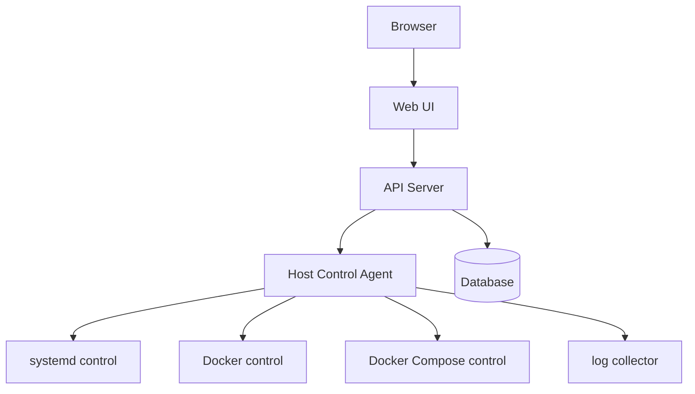
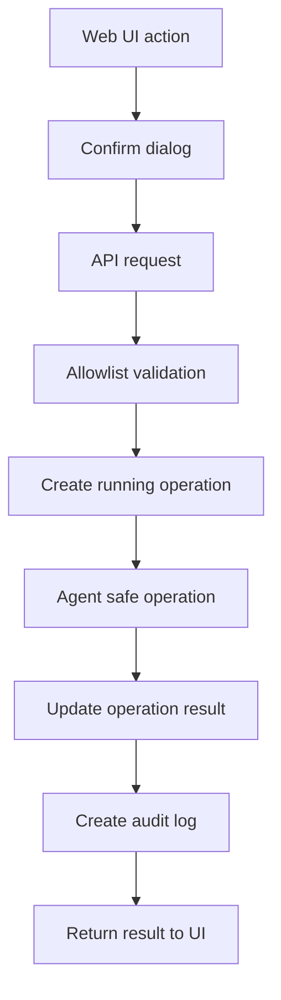

# 詳細設計

## 全体構成

## 技術スタック

| 区分 | 技術 |
| --- | --- |
| Web UI | Next.js / React / TypeScript |
| CSS | Tailwind CSS |
| API | FastAPI |
| Agent | Python |
| DB | PostgreSQL、ローカル SQLite fallback |
| 起動方式 | Docker Compose |
| 設定 | YAML / environment variables |

## API

| 領域 | Endpoint |
| --- | --- |
| Dashboard | `GET /api/dashboard` |
| systemd | `GET /api/systemd/units`, `GET /api/systemd/units/{id}`, `GET /api/systemd/units/{id}/logs`, `POST /api/systemd/units/{id}/actions/{action}` |
| Docker | `GET /api/docker/containers`, `GET /api/docker/containers/{id}`, `GET /api/docker/containers/{id}/logs`, `POST /api/docker/containers/{id}/actions/{action}` |
| Compose | `GET /api/compose/projects`, `GET /api/compose/projects/{id}`, `GET /api/compose/projects/{id}/ps`, `GET /api/compose/projects/{id}/logs`, `POST /api/compose/projects/{id}/actions/restart` |
| Operations | `GET /api/operations`, `GET /api/operations/{id}` |
| Audit | `GET /api/audit-logs` |

## DB

| テーブル | 用途 |
| --- | --- |
| `operation_history` | 操作開始/終了、対象、結果、時間、エラー |
| `audit_logs` | 操作/閲覧/エラーイベント、IP、User-Agent、結果 |
| `managed_targets` | allowlist 由来の管理対象メタデータ |

## 操作フロー

## 禁止操作

`docker rm`、`docker rmi`、`docker volume rm`、`docker system prune`、`docker compose down -v`、`docker exec`、任意 shell 実行、`systemctl disable`、`systemctl mask`、`systemctl daemon-reload`、`reboot`、`shutdown` は実装しない。
